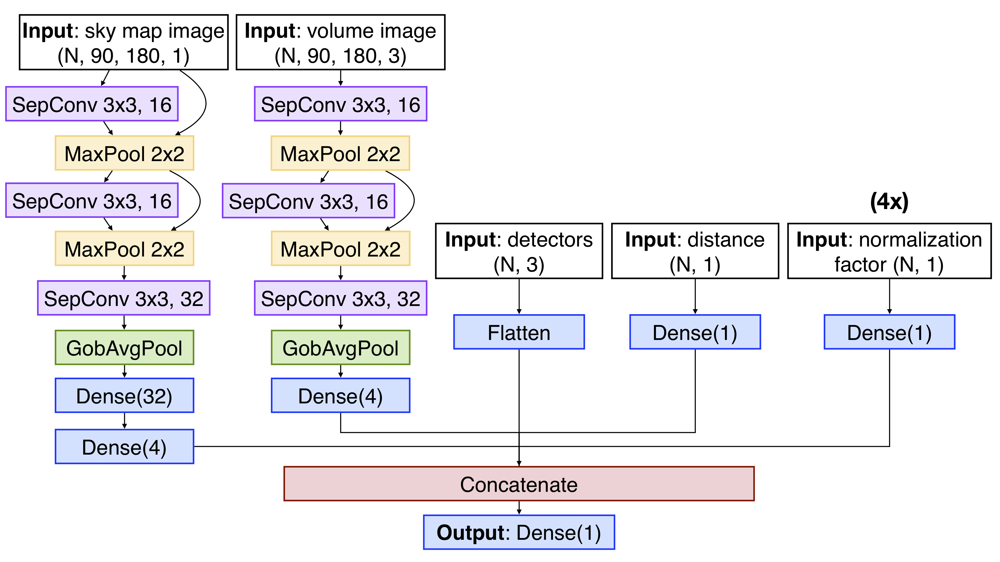
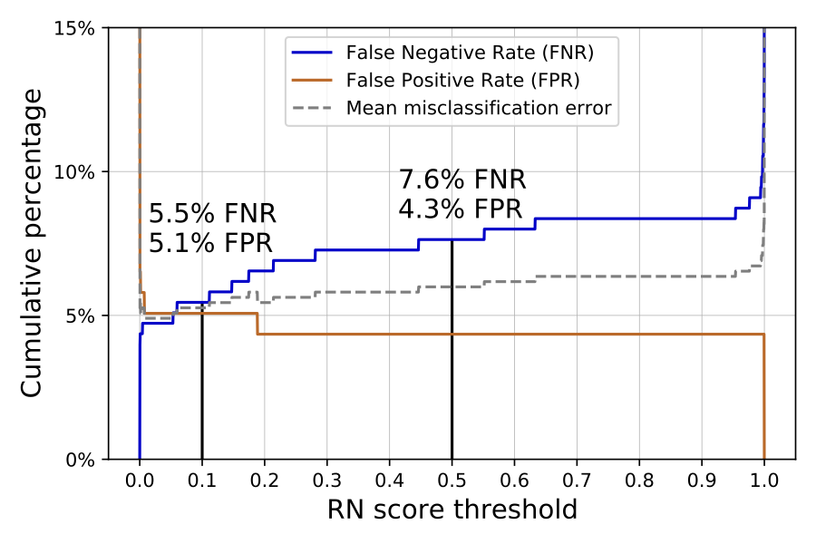

# GWSkyNet
## A real-time classifier for public gravitational-wave candidates
**Miriam Cabero<sup>1</sup>, Ashish Mahabal<sup>2,3</sup>, Jess McIver<sup>1</sup>**

 <sub>1. Department of Physics and Astronomy, The University of British Columbia, Vancouver, BC V6T 1Z4, Canada</sub><br/>
 <sub>2. Division of Physics, Mathematics, and Astronomy, California Institute of Technology, Pasadena, CA 91125, USA</sub><br/>
 <sub>3. Center for Data Driven Discovery, California Institute of Technology, Pasadena, CA 91125, USA</sub>

The rapid release of accurate sky localization for gravitational-wave candidates is crucial for multi-messenger observations. Advanced [LIGO](https://www.ligo.org/) and Advanced [Virgo](https://www.virgo-gw.eu/) release 3D sky localization maps in [GraceDB](https://gracedb.ligo.org/latest/) within minutes of detection. Occasionally, gravitational-wave candidates may originate from instrumental artefacts, and astronomers must decide which candidates to follow up based on publicly available information. GWSkyNet is a non-sequential convolutional neural network real/noise classifier designed to distinguish between astrophysical events and instrumental artefacts. This classifier uses public data from LIGO-Virgo available in the BAYESTAR FITS files from GraceDB. On a testing data set,
GWSkyNet achieves a prediction accuracy of 93.5%.

For details, please see [this paper](https://arxiv.org/abs/2010.11829).<br/>
If you use the material provided here, please cite the paper using the reference:
```
@article{cabero2020gwskynet,
      title={GWSkyNet: a real-time classifier for public gravitational-wave candidates}, 
      author={Miriam Cabero and Ashish Mahabal and Jess McIver},
      year={2020},
      eprint={2010.11829},
      archivePrefix={arXiv},
      primaryClass={gr-qc}
}
```

### Use GwSkyNet

You can use GWSkyNet to classify the LIGO-Virgo public candidates from the third observing run, available in [GraceDB](https://gracedb.ligo.org/superevents/public/O3/). See this Python3 [jupyter notebook](nb/GWSkyNet_predict.ipynb). NOTE: both files [GWSkyNet\_v1.h5](nb/GWSkyNet_v1.h5) and [GWSkyNet\_v1.json](nb/GWSkyNet_v1.json) are needed to run the notebook.

GWSkyNet has only been trained on candidates from [modeled searches](https://emfollow.docs.ligo.org/userguide/analysis/searches.html). Please refrain from using candidates detected by unmodeled searches (classified as group "Burst" in GraceDB and in the GCN Notice).

Packages used (some earlier versions might work as well):
- numpy 1.18.5
- healpy 1.14.0
- requests 2.24.0
- astropy 4.0.3
- reproject 0.7.1
- ligo.skymap 0.5.0
- tensorflow 2.3.1

### Architecture

GWSkyNet architecture. The first two branches are convolutional neural networks with residual connections for image data. The shape of the input data is indicated in parenthesis, with N the number of examples in the training set. The numbers in the SeparableConv2D (SepConv) and MaxPool layers indicate the kernel size in pixels and the number of filters (when applicable). The number in the Dense layers indicates the number of units.



### Performance

False Positive Rate (FPR) and False Negative Rate (FNR) as functions of the Real-Noise (RN) score threshold. At a score threshold RN$\ge$0.5, GWSkyNet yields 7.6% FNR and 4.3% FPR. Lowering the threshold to RN$\ge$0.1 reduces the FNR to 5.5%, with small variation on the FPR (5.1%). The intersection is at RN=0.06, with FPR=FNR=5.1%.


